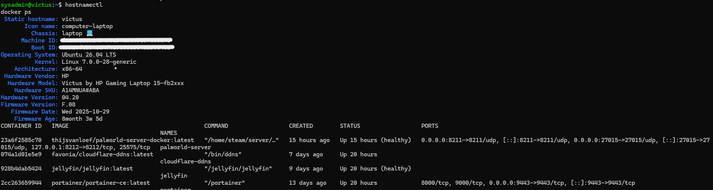
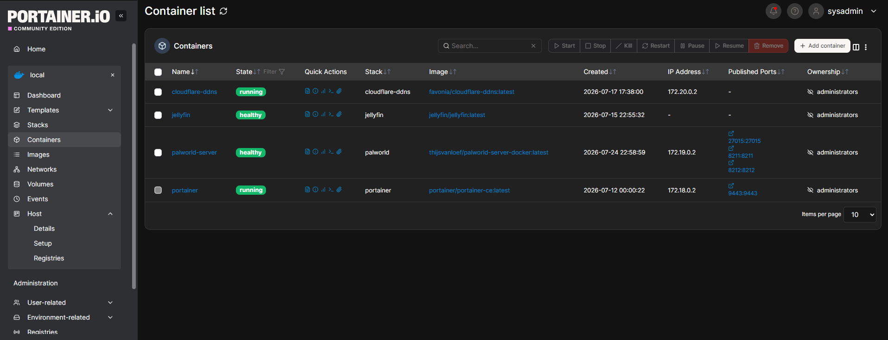

# 🏠 Ubuntu Home Server

Enterprise-style Ubuntu Server homelab featuring Docker, Portainer, Jellyfin, Samba, Cloudflare DDNS, and dedicated game server hosting.

---


---

## 📑 Table of Contents

- [Overview](#-overview)
- [Why I Built This](#-why-i-built-this)
- [System Architecture](#-system-architecture)
- [Objectives](#-objectives)
- [Hardware](#-hardware)
- [Software Stack](#-software-stack)
- [Design Decisions](#-design-decisions)
- [Challenges & Solutions](#-challenges--solutions)
- [Skills Demonstrated](#-skills-demonstrated)
- [Project Highlights](#-project-highlights)
- [Future Improvements](#-future-improvements)
  
---

# 📖 Overview

I built this Ubuntu Server homelab to become comfortable with Linux while creating infrastructure that provides real value to the people around me.

Rather than building a lab solely for learning, I wanted to create services that I would actually use every day. This project has grown into a platform for media streaming, file sharing, and dedicated game hosting for friends and family.

One of my favorite moments was successfully hosting a Palworld server that supported seven players at once. Seeing people actively use something I built reinforced that the best way to learn infrastructure is by solving real problems for real users.

Throughout this project I gained hands-on experience with Linux administration, networking, Docker containerization, firewall configuration, storage management, DNS, and troubleshooting by building, breaking, and continuously improving a production-style home server.

---

# 💭 Why I Built This

When I started this project, my biggest concern was ending up with a complicated environment that I didn't understand.

I wanted to avoid blindly following tutorials and instead learn how each component worked so I could confidently troubleshoot issues, explain the architecture, and maintain it over time.

Every service added to this server became an opportunity to better understand Linux, networking, Docker, and systems administration through hands-on experience.

---

# 🏗️ System Architecture

```text
                        Internet
                            │
                      Cloudflare DDNS
                            │
                     Xfinity Gateway
                            │
                     Port Forwarding
                            │
                       UFW Firewall
                            |
                ┌─────────────────────────┐
                │     Ubuntu Server       │
                │      HP Victus 15       │
                └─────────────────────────┘
                            │
                       Docker Engine
           ┌────────────────┼─────────────────┐
           │                │                 │
       Portainer        Jellyfin      Palworld Server
                            │
                          Samba
                            │
            Windows PCs • Smart TVs • Friends

```
## 📸 Ubuntu Server

The server is administered entirely through SSH using the Linux command line. Docker is used to host containerized services including Jellyfin, Portainer, Cloudflare DDNS, and a dedicated Palworld server.

<p align="center">
  
</p>

---

# 🎯 Objectives

- Learn Linux administration
- Deploy containerized applications using Docker
- Manage containers with Portainer
- Configure secure network services
- Host dedicated game servers
- Centralize media with Jellyfin
- Configure Samba network shares
- Practice infrastructure documentation

---

# 🖥️ Host Specifications

| Component | Specification |
|------------|--------------|
| System | HP Victus 15 |
| CPU | AMD Ryzen 5 8645HS |
| Memory | 32 GB DDR5 |
| GPU | NVIDIA RTX 4050 |
| Storage | 500 GB NVMe SSD |
| Operating System | Ubuntu Server 26.04 LTS |

---

# 🧰 Software Stack

| Technology | Purpose |
|------------|---------|
| Ubuntu Server | Operating System |
| Docker | Containerization Platform |
| Portainer | Container Management |
| Jellyfin | Media Streaming |
| Samba | Network File Sharing |
| Cloudflare DDNS | Dynamic DNS Management |
| SSH | Remote Administration |
| UFW | Firewall |
| Palworld Dedicated Server | Multiplayer game hosting |

---

## 📦 Docker Container Management

Applications are deployed as Docker containers and managed through Portainer. This centralized interface provides visibility into container health, networking, and lifecycle management while allowing individual services to be updated or maintained independently.

<p align="center">
  
</p>

---

# 🧠 Design Decisions

## Why Ubuntu Server?

I chose Ubuntu Server because I wanted to become comfortable with Linux in an environment commonly used for servers and infrastructure.

## Why Docker?

Docker allowed me to isolate applications into individual containers, making deployment, updates, and troubleshooting significantly easier than installing services directly on the operating system.

## Why Portainer?

Portainer provides a clean web interface for managing Docker containers while still allowing me to learn Docker's command-line tools.

## Why Jellyfin?

I wanted a self-hosted media server that I owned and controlled without subscription fees.

## Why Samba?

Samba allowed Windows devices on my network to access centralized media and shared files.

## Why Cloudflare DDNS?

My home internet connection uses a dynamic public IP address.

Cloudflare DDNS automatically updates my DNS records whenever my public IP changes, allowing me to reliably access services without manually updating DNS records.

## Why UFW?

UFW provided a simple way to manage firewall rules while limiting network exposure to only the required services.

---

# 🛠️ Challenges & Solutions

Building this homelab was an iterative process. Nearly every service introduced a new technical challenge that required research, troubleshooting, and a better understanding of how Linux infrastructure works. Rather than avoiding these issues, I used each one as an opportunity to improve my troubleshooting process and deepen my understanding of the technologies involved.

---

## 🐧 Learning Linux Without a GUI

### Challenge

My biggest concern when starting this project was creating a complicated environment that I didn't truly understand. I wanted to avoid relying on graphical interfaces or blindly following tutorials.

### Solution

I committed to administering the server primarily through SSH and the Linux command line. Instead of simply copying commands, I focused on understanding what each command did, how services interacted with one another, and how to verify configurations after making changes.

### Outcome

This approach significantly increased my confidence using Linux and gave me the ability to troubleshoot issues independently rather than relying on step-by-step guides.

---

## 🐳 Understanding Docker & Containerization

### Challenge

Docker introduced an entirely new deployment model that differed from traditional software installation. Understanding containers, persistent storage, networking, and port mappings was initially unfamiliar.

### Solution

I deployed each service individually, learning how Docker containers communicate with the host system, how volumes preserve application data, and how container networking affects service accessibility.

### Outcome

I now use Docker as the primary deployment method for applications on this server and understand the advantages of containerized infrastructure for maintenance, updates, and isolation.

---

## 🌐 Publishing Services to the Internet

### Challenge

Making services accessible outside of my home network required understanding several networking concepts working together, including dynamic public IP addresses, DNS, router port forwarding, and host firewall rules.

### Solution

I implemented Cloudflare DDNS to automatically update DNS records whenever my public IP address changed, configured router port forwarding for required services, and secured the server using UFW by allowing only the ports necessary for published applications.

### Outcome

The server can reliably host public-facing services while minimizing unnecessary network exposure and improving my understanding of real-world networking concepts.

---

## 🎮 Hosting a Reliable Palworld Server

### Challenge

Deploying a dedicated multiplayer game server required troubleshooting Docker networking, firewall rules, and external connectivity to ensure players outside my local network could successfully connect.

### Solution

I validated Docker container configuration, verified port mappings, adjusted firewall rules, confirmed router forwarding, and tested connectivity until external access was functioning reliably.

### Outcome

The server successfully hosted seven concurrent players, demonstrating that the infrastructure was stable enough to support real-world use by friends and family.

---

## 📁 Centralizing File Storage

### Challenge

I wanted media and shared files to be accessible from multiple Windows devices without relying on local storage or constantly transferring files between computers.

### Solution

I configured Samba network shares with appropriate permissions, allowing Windows systems on my local network to securely access centralized storage hosted on the Ubuntu server.

### Outcome

The server became the central storage location for media and shared files, simplifying management while improving my understanding of Linux file permissions and network file sharing.

---

## 📚 Documentation & Knowledge Retention

### Challenge

One of my original goals was to avoid building a system that I couldn't explain or maintain months later.

### Solution

I documented architecture decisions, deployment choices, networking configuration, and lessons learned throughout the project. Creating this repository became part of the engineering process rather than something completed afterward.

### Outcome

The documentation now serves as both a technical reference for future maintenance and a record of the knowledge gained throughout the project.

---

## 💡 Skills Demonstrated

### Systems Administration

- Linux
- SSH
- User Management

### Networking

- DNS
- Port Forwarding
- Firewall Configuration
- Dynamic DNS

### Containerization

- Docker
- Portainer
- Persistent Storage

### Infrastructure

- Documentation
- Troubleshooting
- Service Deployment

---

# 📊 Project Highlights

- Successfully deployed an Ubuntu Server homelab from scratch.
- Learned Linux administration through daily command-line usage.
- Deployed multiple containerized services using Docker.
- Configured centralized file sharing with Samba.
- Hosted a dedicated Palworld server supporting seven concurrent players.
- Implemented Cloudflare DDNS for reliable remote accessibility.
- Documented the environment to support long-term maintenance and future expansion.

---

# 🚀 Future Improvements

- Implement Nginx Proxy Manager for reverse proxy management
- Secure Internet-facing services with HTTPS certificates
- Deploy Grafana and Prometheus for monitoring
- Automate container updates where appropriate
- Add scheduled backups for application data
- Expand game server hosting

---

## 📈 Project Status

🟢 Active Development

This repository is updated as I continue improving my Ubuntu homelab and expanding the services it provides.
